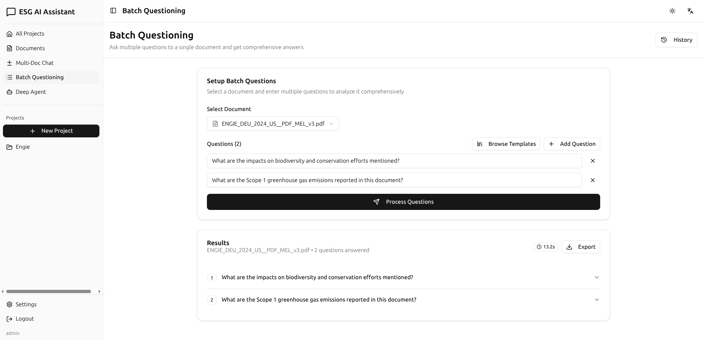
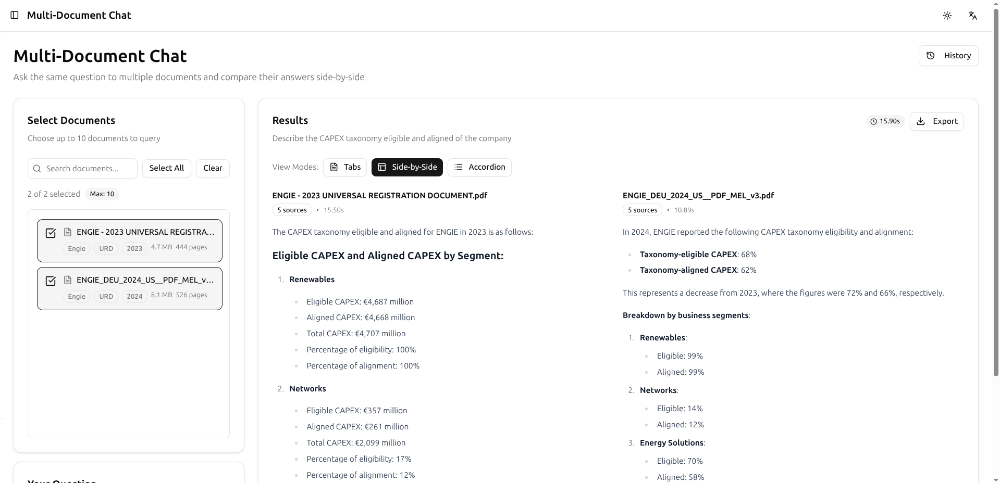
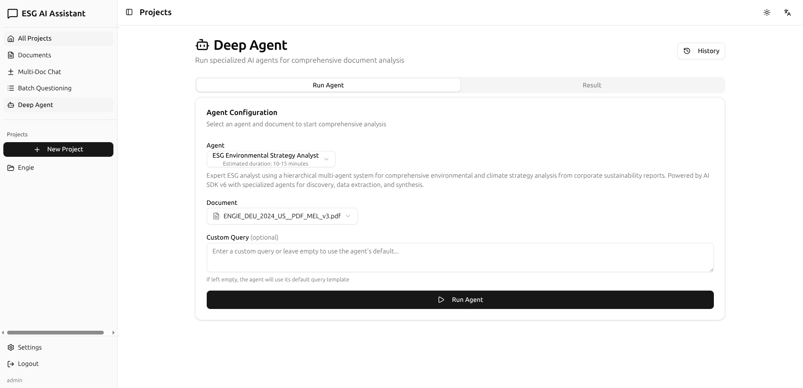
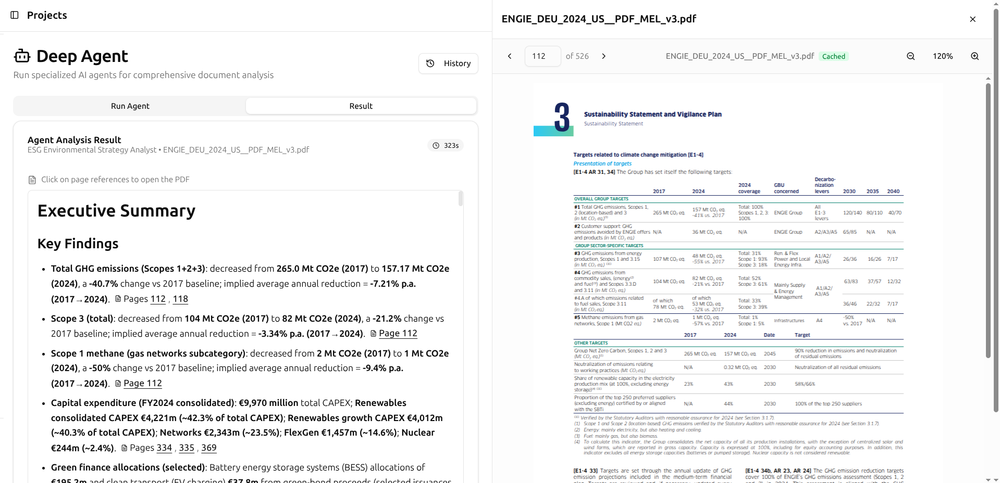

# AI Assistant

> **Note**: This is a toy/experimental project built to explore what's possible with modern AI APIs, TypeScript, and document processing. It demonstrates meaningful interaction with PDFs, productivity-focused features, and innovative approaches to working with AI at scale.

A full-stack AI chat application built with Bun 1.3, React 19, and the AI SDK. Features document chat with RAG (Retrieval-Augmented Generation), multiple AI providers, and project-based conversation organization.

## Features Overview

### Batch Questioning

Ask multiple questions at once and get comprehensive answers for each:


_Export results in PDF/Markdown/Docx/Json_

### Multi-Document Chat

Query across multiple documents simultaneously and get consolidated answers:


_Export results in PDF/Markdown/Docx/Json_

### DeepAgent Analysis

Multi-agent system for comprehensive document analysis with hierarchical processing:


### Interactive Results

Split-screen view with clickable page citations and PDF viewer integration:

_Results include proper source citations and integrated PDF viewer for verification_

### Core Features

- **Project Organization**: Organize conversations into projects
- **Multiple AI Providers**: Support for OpenAI (GPT-4, GPT-4o) and Anthropic (Claude) models
- **Streaming Responses**: Real-time streaming of AI responses
- **Persistent History**: All conversations and messages stored in SQLite
- **Modern UI**: Built with React 19, shadcn/ui, and Tailwind CSS 4
- **Internationalization**: English and French language support
- **Dark Mode**: Light, dark, and system theme options

### Advanced Features

- **Document Chat with RAG**: Upload PDFs and chat with them using vector search
- **DeepAgent Analysis**: Multi-agent system for comprehensive document analysis with clickable page citations
- **Weaviate Vector Database**: Semantic search with OpenAI embeddings
- **S3 Storage**: Document storage on OVH S3
- **Batch Questioning**: Ask multiple questions across multiple documents
- **Multi-Document Chat**: Query multiple documents simultaneously
- **Conversation Export**: Export conversations to JSON, Markdown, DOCX, and PDF
- **Interactive PDF Viewer**: Split-screen view with clickable page references and scroll preservation
- **Mock Authentication**: Simple authentication system for development

## Tech Stack

- **Runtime**: Bun 1.3 (server + bundler)
- **Frontend**: React 19 + shadcn/ui + Tailwind CSS 4
- **Backend**: Bun.serve() with REST API
- **Database**: SQLite3 (PostgreSQL-compatible schema)
- **Vector Database**: Weaviate 1.33.0 with text2vec-openai
- **Storage**: OVH S3 (via Bun's built-in S3Client)
- **AI**: AI SDK with OpenAI and Anthropic providers
- **State Management**: TanStack Query for data fetching
- **PDF Processing**: pdf-parse v2 with Worker threads
- **Internationalization**: i18next + react-i18next
- **Theming**: next-themes for dark mode

## Getting Started

### Prerequisites

- Bun 1.3 or later installed
- Docker and Docker Compose (for Weaviate and PostgreSQL)
- OpenAI API key (required for embeddings and GPT models)
- Anthropic API key (optional, if using Claude models)
- OVH S3 credentials (for document storage)

### Installation

1. Clone the repository and install dependencies:

```bash
bun install
```

2. Create a `.env` file in the root directory:

```bash
cp .env.example .env
```

3. Add your configuration to the `.env` file:

```env
# Database
DATABASE_PATH=./data/database/chat.db

# OpenAI API Configuration (REQUIRED for embeddings)
OPENAI_API_KEY=your_openai_api_key_here

# Anthropic API Configuration
ANTHROPIC_API_KEY=your_anthropic_api_key_here

# Server Configuration
PORT=3001
NODE_ENV=development

# Weaviate Configuration
WEAVIATE_HOST=http://localhost:8080
WEAVIATE_API_KEY=

# S3 Storage Configuration (OVH)
S3_ACCESS_KEY_ID=your_access_key_here
S3_SECRET_ACCESS_KEY=your_secret_key_here
S3_BUCKET=ai-assistant-storage
S3_ENDPOINT=https://s3.gra.io.cloud.ovh.net/
S3_REGION=gra

# Session Configuration
SESSION_EXPIRY_DAYS=30
```

4. Start Docker services (Weaviate and PostgreSQL):

```bash
docker compose up -d
```

5. Initialize Weaviate collections:

```bash
bun src/scripts/test-weaviate.ts
```

### Development

Start the development server with hot module reloading:

```bash
bun dev
# or with hot reload
bun --hot src/index.tsx
```

The server will run at `http://localhost:3001` by default.

### First Login

The application uses mock authentication for development:

- Enter any **username** (e.g., "admin", "demo", "testuser")
- Enter any **password** (all passwords accepted in dev mode)
- A user will be automatically created on first login

### Production

```bash
bun start
```

## Project Structure

```
src/
├── api/                    # API route handlers
│   ├── projects.ts        # Project CRUD operations
│   ├── conversations.ts   # Conversation management
│   └── chat.ts            # Chat streaming and models
├── components/            # React components
│   ├── Layout.tsx         # Main layout
│   └── ui/                # shadcn/ui components
├── pages/                 # Page components
│   ├── ProjectsPage.tsx   # Projects and conversations list
│   └── ConversationPage.tsx # Chat interface
├── hooks/                 # Custom React hooks
│   └── useApi.ts          # API hooks using TanStack Query
├── lib/                   # Utilities
│   └── db.ts              # Database queries and initialization
├── types/                 # TypeScript types
│   ├── database.ts        # Database schema types
│   └── api.ts             # API types and constants
├── index.tsx              # Server entry point
├── App.tsx                # Main React app
└── frontend.tsx           # React app bootstrap
```

## API Endpoints

### Authentication

- `POST /api/auth/login` - Login (mock authentication)
- `POST /api/auth/logout` - Logout
- `GET /api/me` - Get current user
- `POST /api/auth/refresh` - Refresh session

### Projects

- `GET /api/projects` - Get all projects
- `POST /api/projects` - Create a new project
- `GET /api/projects/:id` - Get project with conversations
- `PUT /api/projects/:id` - Update a project
- `DELETE /api/projects/:id` - Delete a project

### Conversations

- `GET /api/conversations?project_id=:id` - Get conversations for a project
- `POST /api/conversations` - Create a new conversation
- `GET /api/conversations/:id` - Get conversation with messages
- `PUT /api/conversations/:id` - Update conversation title
- `DELETE /api/conversations/:id` - Delete a conversation
- `GET /api/conversations/:id/export?format=json|md|docx|pdf` - Export conversation

### Chat

- `POST /api/chat/stream` - Stream chat response
- `POST /api/chat/save-message` - Save assistant message
- `GET /api/models` - Get available AI models

### Documents

- `POST /api/documents/upload` - Upload PDF document
- `GET /api/documents` - Get all documents
- `GET /api/documents/:id` - Get document by ID
- `GET /api/documents/:id/pdf` - Download PDF file (via proxy)
- `DELETE /api/documents/:id` - Delete document
- `POST /api/documents/:id/analyze` - Analyze document

### RAG (Document Chat)

- `POST /api/rag/query` - Query single document
- `POST /api/rag/multi-doc-query` - Query multiple documents
- `POST /api/rag/batch-questions` - Ask multiple questions on one document
- `POST /api/rag/multi-doc-export?format=json|md|docx|pdf` - Export multi-doc query results

### Settings

- `GET /api/settings` - Get user preferences
- `PUT /api/settings` - Update user preferences

### DeepAgent

- `GET /api/deepagent/agents` - List available agent configurations
- `POST /api/deepagent/run` - Start agent analysis (returns immediately with run ID)
- `GET /api/deepagent/runs/:id` - Poll for run status and results
- `GET /api/deepagent/history?limit=50` - Get user's analysis history
- `GET /api/deepagent/document/:documentId/runs` - Get runs for specific document

## Database Schema

### SQLite Database

**users** - User accounts

- `id` - Primary key
- `email` - User email (unique)
- `name` - User name
- `username` - Username for login
- `roles` - JSON array (["user", "admin"])
- `is_active` - Active status
- `created_at`, `updated_at` - Timestamps

**user_preferences** - User settings

- `user_id` - Foreign key to users
- `default_model_provider`, `default_model_name` - AI model defaults
- `theme` - UI theme ('light' | 'dark' | 'system')
- `language` - UI language ('en' | 'fr')
- `disclaimer_accepted_at` - Terms acceptance timestamp

**projects** - Project organization

- `id` - Primary key
- `user_id` - Foreign key to users
- `name`, `description` - Project info
- `is_private` - Privacy flag

**conversations** - Chat sessions

- `id` - Primary key
- `project_id` - Foreign key to projects
- `title` - Conversation title
- `model_provider`, `model_name` - AI model used

**messages** - Chat messages

- `id` - Primary key
- `conversation_id` - Foreign key to conversations
- `role` - 'user' | 'assistant' | 'system'
- `content` - Message text

**documents** - Uploaded PDFs

- `id` - Primary key
- `user_id` - Foreign key to users
- `filename`, `file_slug` - File identification
- `s3_key`, `s3_url` - S3 storage location
- `processing_status` - 'pending' | 'processing' | 'completed' | 'failed'
- `pages_processed`, `chunks_created` - Processing stats

**agent_runs** - DeepAgent execution history

- `id` - UUID primary key
- `user_id` - Foreign key to users
- `agent_config_id` - Agent configuration identifier
- `document_id` - Foreign key to documents
- `query` - User query or agent default
- `status` - 'running' | 'completed' | 'failed'
- `result` - Final analysis result (markdown with page citations)
- `intermediate_results` - JSON with all phase results
- `error` - Error message if failed
- `started_at`, `completed_at` - Timestamps
- `duration_seconds` - Execution duration

**agent_messages** - DeepAgent step-by-step logs

- `id` - Primary key
- `agent_run_id` - Foreign key to agent_runs
- `role` - 'user' | 'assistant' | 'system' | 'tool'
- `content` - Message content
- `tool_name`, `tool_input`, `tool_output` - Tool execution details
- `created_at` - Timestamp

**sessions** - User sessions

- `id` - Session token
- `user_id` - Foreign key to users
- `access_token`, `refresh_token` - Auth tokens
- `expires_at` - Expiration timestamp

### Weaviate Collections

**ParentDocument** - Full page content (no vectorizer)

- `content`, `path`, `page`, `filename` - Page data
- `company_id`, `company_name`, `report_type`, `reporting_year` - Metadata

**ChildDocument** - Text chunks with embeddings (text2vec-openai)

- Same properties as ParentDocument
- Automatically vectorized for semantic search
- References parent page

## Supported AI Models

### OpenAI

- GPT-4 Omni (gpt-4o)
- GPT-4 Omni Mini (gpt-4o-mini)
- GPT-4 Turbo (gpt-4-turbo)
- GPT-4 (gpt-4)

### Anthropic

- Claude 3.5 Sonnet (claude-3-5-sonnet-20241022)
- Claude 3 Opus (claude-3-opus-20240229)
- Claude 3 Sonnet (claude-3-sonnet-20240229)
- Claude 3 Haiku (claude-3-haiku-20240307)

## Key Features Explained

### Document Chat with RAG

1. **Upload PDFs**: Upload sustainability reports, research papers, or any PDF document
2. **Automatic Processing**:
   - Text extraction per page
   - Recursive text chunking (1000 chars with 200 overlap)
   - Upload to S3 storage
   - Vectorization with OpenAI embeddings
3. **Semantic Search**: Ask questions and get relevant answers from your documents
4. **Source Attribution**: All answers include page numbers and source text

### DeepAgent Analysis

The application includes a hierarchical multi-agent system for comprehensive document analysis:

1. **Specialized Agents**: Pre-configured agents (e.g., ESG Environmental Strategy Analyst) that perform in-depth analysis
2. **Three-Phase Analysis**:
   - **Discovery Phase**: Maps document structure and locates relevant sections
   - **Extraction Phase**: Four specialized agents run in parallel to extract specific data (emissions, targets, investments, risks)
   - **Synthesis Phase**: Aggregates findings and produces comprehensive reports
3. **Interactive Results**:
   - **Clickable Page Citations**: Results include page references in format `[Page X]` or `[Pages X-Y]`
   - **Individual Click Support**: Each page number in multi-page references is clickable (e.g., "Pages 1, 3, 10")
   - **Split-Screen View**: Results displayed on left, PDF viewer on right
   - **Scroll Preservation**: Scroll position maintained when clicking page references
4. **Background Processing**: Long-running analyses execute in worker threads with real-time status polling

### Batch Questioning

- Upload a document
- Ask multiple questions at once
- Get comprehensive answers for each question
- Export results in multiple formats

### Multi-Document Chat

- Query across multiple documents simultaneously
- Compare information from different sources
- Get consolidated answers with sources

### Export Options

- **JSON**: Complete data structure
- **Markdown**: Formatted document
- **DOCX**: Word document
- **PDF**: Professional PDF report

## Testing & Scripts

```bash
# Test Weaviate connection and collections
bun src/scripts/test-weaviate.ts

# Test S3 storage operations
bun src/scripts/test-s3.ts

# Test PDF processing pipeline
bun src/scripts/test-pdf-processing.ts

# Test vectorizer functionality
bun src/scripts/test-vectorizer.ts

# Reset Weaviate collections (if needed)
bun src/scripts/reset-weaviate-collections.ts
```

## Future Enhancements

- Real authentication system (OAuth, Auth0, etc.)
- Multi-user collaboration features
- Advanced prompt management and templates
- Cost tracking and usage analytics
- API key management per user
- Conversation branching
- Voice input/output

## Troubleshooting

### Weaviate Issues

- **Connection refused**: Ensure Weaviate is running: `docker compose ps`
- **Vectorization errors**: Check OpenAI API key is set in `.env`
- **Collections not found**: Run `bun src/scripts/test-weaviate.ts`

### S3 Storage Issues

- **Upload fails**: Verify S3 credentials in `.env`
- **403 Forbidden**: Check S3_ACCESS_KEY_ID and S3_SECRET_ACCESS_KEY

### PDF Processing Issues

- **Processing fails**: Ensure Weaviate and S3 are properly configured
- **No results in search**: Check that documents finished processing successfully

### Authentication Issues

- **Can't login**: Any username/password works in dev mode - user is created automatically
- **Session expired**: Login again to create a new session

## Contributing

This is a generic AI assistant application. Feel free to customize for your needs.

## License

MIT License - Free to use and modify.
