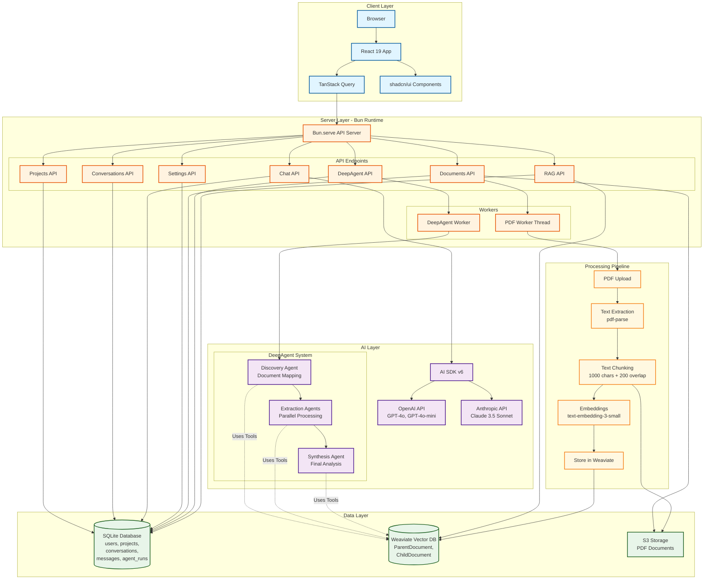
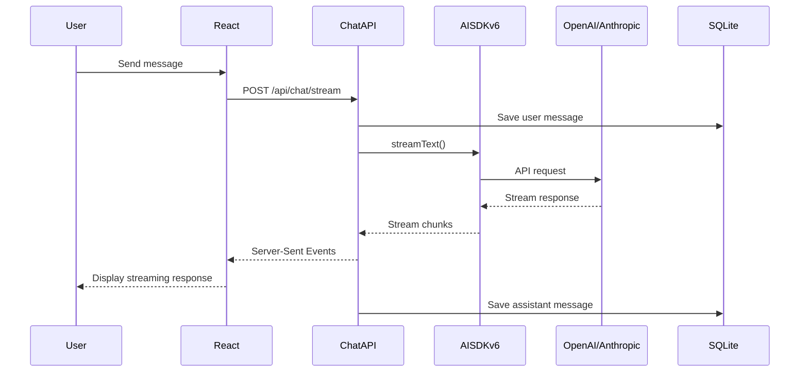
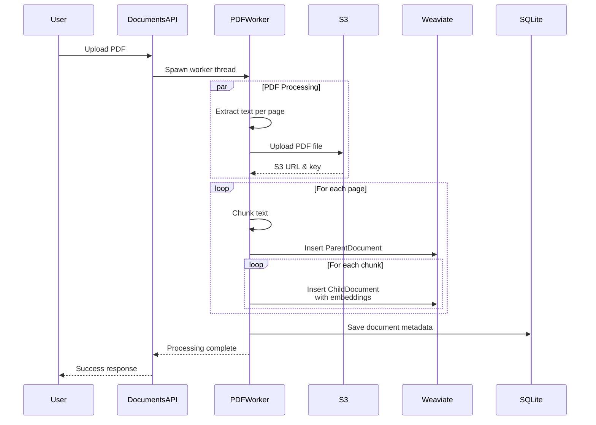
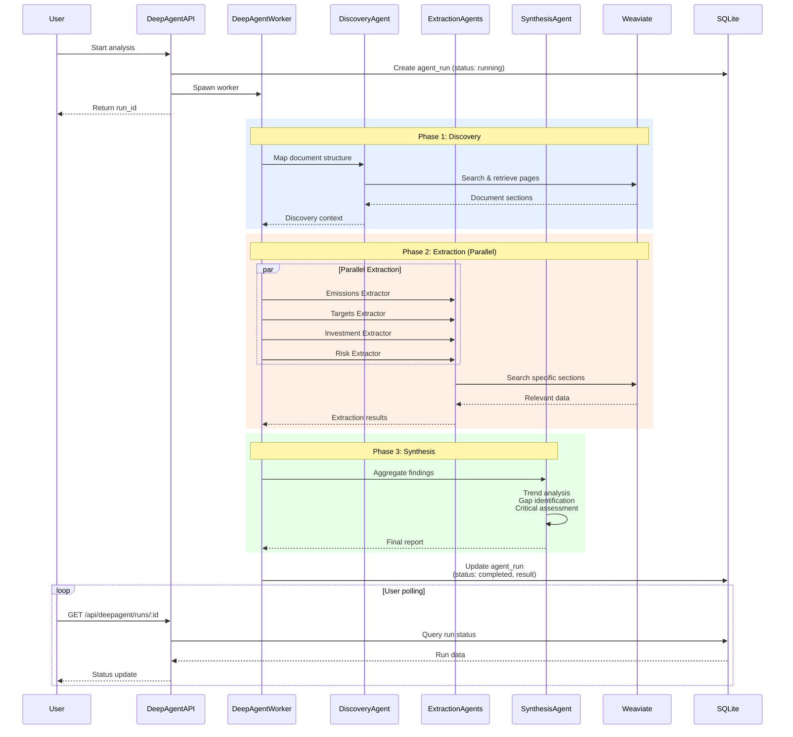
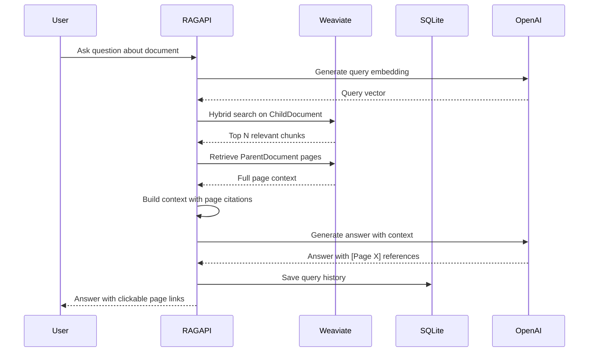

# System Architecture Diagram

## Data Flow Examples

### 1. Simple Chat Flow

### 2. PDF Processing Flow

### 3. DeepAgent Analysis Flow

### 4. RAG Query Flow

## Key Architecture Patterns

### 1. Parent/Child RAG Strategy
- **ChildDocument**: Small chunks (1000 chars) with embeddings for semantic search
- **ParentDocument**: Full pages without embeddings for context retrieval
- **Benefit**: Fast semantic search + comprehensive context

### 2. Worker Thread Pattern
- Long-running tasks (PDF processing, DeepAgent) run in separate threads
- Prevents HTTP timeouts
- Enables real-time progress polling
- Non-blocking server operation

### 3. Hierarchical Multi-Agent System
- **Phase 1**: Discovery agent maps document structure
- **Phase 2**: Specialized extractors run in parallel
- **Phase 3**: Synthesis agent aggregates and analyzes
- **Benefit**: Comprehensive analysis with parallelization

### 4. Streaming Architecture
- AI responses stream via Server-Sent Events (SSE)
- Real-time UI updates
- Automatic message persistence
- Better user experience for long responses

### 5. API Proxy Pattern
- PDFs accessed via `/api/documents/:id/pdf` (not direct S3 URLs)
- Server-side authentication
- Proper CORS handling
- Client-side caching
